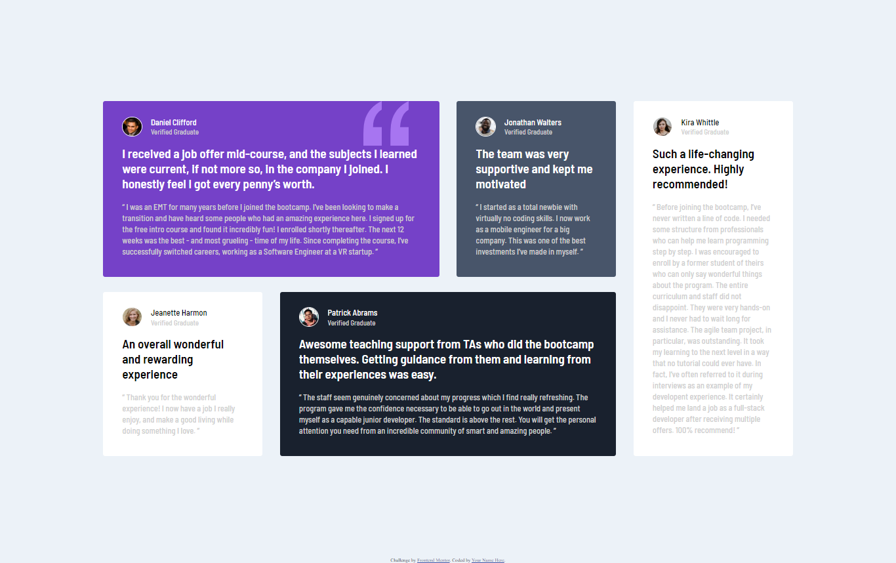

# Frontend Mentor - Testimonials grid section solution

This is a solution to the [Testimonials grid section challenge on Frontend Mentor](https://www.frontendmentor.io/challenges/testimonials-grid-section-Nnw6J7Un7). Frontend Mentor challenges help you improve your coding skills by building realistic projects. 

## Table of contents

- [Overview](#overview)
  - [The challenge](#the-challenge)
  - [Screenshot](#screenshot)
  - [Links](#links)
  - [Built with](#built-with)
- [Author](#author)

**Note: Delete this note and update the table of contents based on what sections you keep.**

## Overview

### The challenge

Users should be able to:

- View the optimal layout for the site depending on their device's screen size

### Screenshot

### Links

- Solution URL: [Add solution URL here](https://github.com/D7RSVN/testimonials-grid-section-main)
- Live Site URL: [Add live site URL here](https://your-live-site-url.com)

### Built with

- CSS custom properties
- CSS Grid
- Mobile-first workflow

## Author

- Frontend Mentor - [@D7RSVN](https://www.frontendmentor.io/profile/D7RSVN)
- Git - [@yourusername](https://github.com/D7RSVN)

